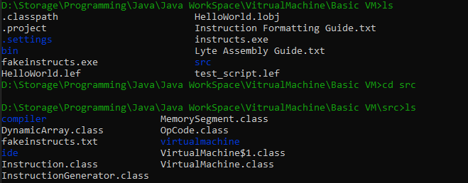

# My List Command

**-- Overview --**

Despite the fact the fact that the vast majority of my software engineering experience has been on Linux operating systems (either professionally or via SSH for academic work), until recently (I now use macOS), my personal machine ran on Windows. Because of this, I always found myself habitually typing 'ls' in my Windows command prompt. With that in mind, I decided to implement my own version of Linux's list command. This repo contains the source code for that command. It's worth noting that there is a small batch script (by small I mean 1 line) which executes the Python driver and accepts arguments, but I did not include it here since it'd really take up more space than it's worth. I also added that script to my machine's path so it could be executed anywhere with the same usage as the original.

**-- Demo Images --**

*Screenshots taken from my brother trying out my ls command.*

A larger terminal window means my ls command adapts by increasing table width to fill more of the window.


And similarly, for smaller windows, the ls command decreases its table width to become more compact.


**-- The Program --**

My list command has a small fraction of the full functionality offered by the original. These are its key features:

    * Mimics the format of the original list command's interface almost exactly
    (meaning a user who habitually uses the original can easily transition)
    * Implements the critically important '-R' recursive listing option as well as '-a' listing.
    * Mimics the original command's color and table formatting with some limitations
        - My command only differentiates files (default color) and directories (navy blue)
          I've been working on upgrading it to identify more kinds of files, but it seems 
          even the original command has issues with this
        - My command uses terminal space slightly less efficiently than the original, 
          but funcionally there is no notable difference
        

And here are some of its major drawbacks:

    * Speed - I think Python alone accounts for a huge slowdown relative to the 
      original, but I'm sure there are optimizations and better practices that 
      I am not taking advantage of. However, functionally this is irrelevant unless
      you recursively list from a high directory
    * Functionality - as I mentioned above, there's a great deal that the original
      command can do, that mine cannot. This project is the kind that can be as small
      or as large as you want it to be, so I'll keep plugging away at new features. 
      See more below.
      
**-- TODOs --**

    * Implement '-l' listing
    * Implement new color coding (ideally executables as green since that is 
      likely the next most valuable distinction)

**-- Usage --**

Without a script...
```
python DriverLS.py [flags] [path to target]
```
**path to target**: path to a directory. Defaults to current working directory.

**flags**: only currently available options are recursive, '-R', and with-hidden-file, '-a'.

Create a script to call the command above and add it to your environment variables to use my list command the same way you use the original.

